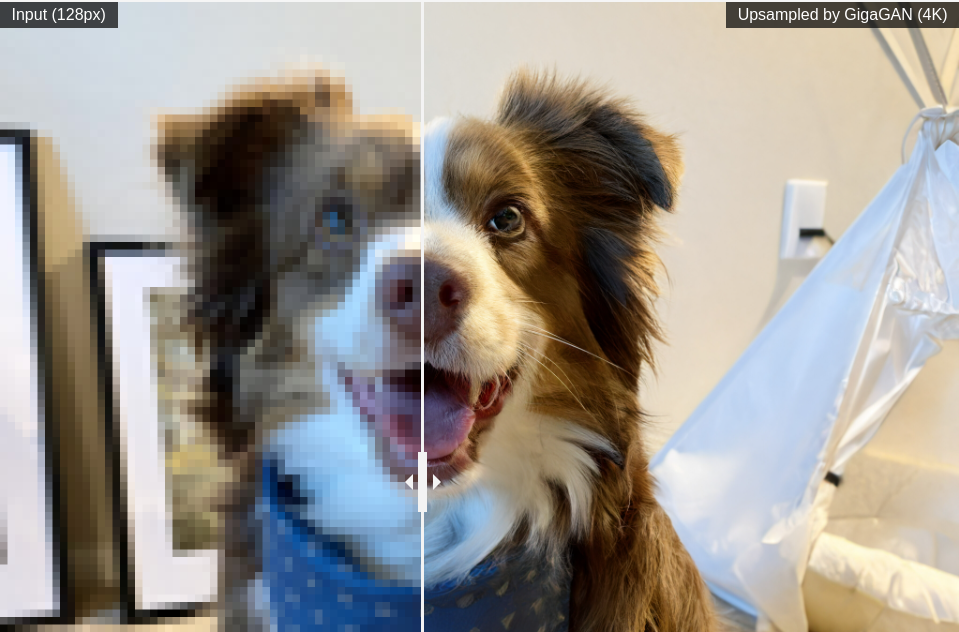
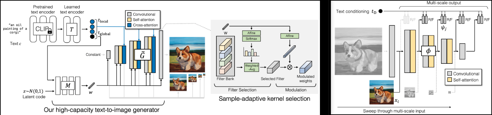

</img>

</img>

## GigaGAN - Pytorch

Implementation of <a href="https://arxiv.org/abs/2303.05511v2">GigaGAN</a> <a href="https://mingukkang.github.io/GigaGAN/">(project page)</a>, new SOTA GAN out of Adobe.

I will also add a few findings from <a href="https://github.com/lucidrains/lightweight-gan">lightweight gan</a>, for faster convergence (skip layer excitation), better stability (reconstruction auxiliary loss in discriminator), and improved generator results (GLU activations).

It will also contain the code for the 1k - 4k upsamplers, which I find to be the highlight of this paper.

Please join <a href="https://discord.gg/xBPBXfcFHd"></a> if you are interested in helping out with the replication with the <a href="https://laion.ai/">LAION</a> community

## Appreciation

- <a href="https://stability.ai/">StabilityAI</a> and <a href="https://huggingface.co/">🤗 Huggingface</a> for the generous sponsorship, as well as my other sponsors, for affording me the independence to open source artificial intelligence.

- <a href="https://huggingface.co/">🤗 Huggingface</a> for their accelerate library

- All the maintainers at <a href="https://github.com/mlfoundations/open_clip">OpenClip</a>, for their SOTA open sourced contrastive learning text-image models

- <a href="https://github.com/XavierXiao">Xavier</a> for the very helpful code review, and for discussions on how the scale invariance in the discriminator should be built!

- <a href="https://github.com/CerebralSeed">@CerebralSeed</a> for pull requesting the initial sampling code for both the generator and upsampler!

## Install

```bash
$ pip install gigagan-pytorch
```

## Usage

Simple unconditional GAN, for starters

```python
import torch

from gigagan_pytorch import (
    GigaGAN,
    ImageDataset
)

gan = GigaGAN(
    generator = dict(
        dim_capacity = 8,
        style_network = dict(
            dim = 64,
            depth = 4
        ),
        image_size = 256,
        dim_max = 512,
        num_skip_layers_excite = 4,
        unconditional = True
    ),
    discriminator = dict(
        dim_capacity = 16,
        dim_max = 512,
        image_size = 256,
        num_skip_layers_excite = 4,
        unconditional = True
    ),
    amp = True
).cuda()

# dataset

dataset = ImageDataset(
    folder = '/path/to/your/data',
    image_size = 256
)

dataloader = dataset.get_dataloader(batch_size = 1)

# you must then set the dataloader for the GAN before training

gan.set_dataloader(dataloader)

# training the discriminator and generator alternating
# for 100 steps in this example, batch size 1, gradient accumulated 8 times

gan(
    steps = 100,
    grad_accum_every = 8
)
```

For unconditional Unet Upsampler

```python
import torch
from gigagan_pytorch import (
    GigaGAN,
    ImageDataset
)

gan = GigaGAN(
    train_upsampler = True,     # set this to True
    generator = dict(
        style_network = dict(
            dim = 64,
            depth = 4
        ),
        dim = 32,
        image_size = 256,
        input_image_size = 128,
        unconditional = True
    ),
    discriminator = dict(
        dim_capacity = 16,
        dim_max = 512,
        image_size = 256,
        num_skip_layers_excite = 4,
        unconditional = True
    ),
    amp = True
).cuda()

dataset = ImageDataset(
    folder = '/path/to/your/data',
    image_size = 256
)

dataloader = dataset.get_dataloader(batch_size = 1)

gan.set_dataloader(dataloader)

# training the discriminator and generator alternating
# for 100 steps in this example, batch size 1, gradient accumulated 8 times

gan(
    steps = 100,
    grad_accum_every = 8
)
```

## Losses (wip)

* `G` - Generator
* `MSG` - Multiscale Generator
* `D` - Discriminator
* `MSD` - Multiscale Discriminator
* `GP` - Gradient Penalty
* `SSL` - Auxiliary Reconstruction in Discriminator (from Lightweight GAN)
* `VD` - Vision-aided Discriminator
* `VG` - Vision-aided Generator
* `CL` - Generator Constrastive Loss
* `MAL` - Matching Aware Loss

A healthy run would have `G`, `MSG`, `D`, `MSD` with values hovering between `0` to `10`, and usually staying pretty constant. If at any time after 1k training steps these values persist at triple digits, that would mean something is wrong. It is ok for generator and discriminator values to occasionally dip negative, but it should swing back up to the range above.

`GP` and `SSL` should be pushed towards `0`. `GP` can occasionally spike; I like to imagine it as the networks undergoing some epiphany

## Multi-GPU Training

The `GigaGAN` class is now equipped with <a href="https://huggingface.co/docs/accelerate/accelerator">🤗 Accelerator</a>. You can easily do multi-gpu training in two steps using their `accelerate` CLI

At the project root directory, where the training script is, run

```python
$ accelerate config
```

Then, in the same directory

```python
$ accelerate launch train.py
```

## Todo

- [x] make sure it can be trained unconditionally
- [x] read the relevant papers and knock out all 3 auxiliary losses
    - [x] matching aware loss
    - [x] clip loss
    - [x] vision-aided discriminator loss
    - [x] add reconstruction losses on arbitrary stages in the discriminator (lightweight gan)
    - [x] figure out how the random projections are used from projected-gan
    - [x] vision aided discriminator needs to extract N layers from the vision model in CLIP
    - [x] figure out whether to discard CLS token and reshape into image dimensions for convolution, or stick with attention and condition with adaptive layernorm - also turn off vision aided gan in unconditional case
- [x] unet upsampler
    - [x] add adaptive conv
    - [x] modify latter stage of unet to also output rgb residuals, and pass the rgb into discriminator. make discriminator agnostic to rgb being passed in
    - [x] do pixel shuffle upsamples for unet
- [x] get a code review for the multi-scale inputs and outputs, as the paper was a bit vague
- [x] add upsampling network architecture
- [x] make unconditional work for both base generator and upsampler
- [x] make text conditioned training work for both base and upsampler
- [x] make recon more efficient by random sampling patches
- [x] make sure generator and discriminator can also accept pre-encoded CLIP text encodings

- [ ] add accelerate
    - [x] works single machine
    - [x] works for mixed precision (make sure gradient penalty is scaled correctly), take care of manual scaler saving and reloading, borrow from imagen-pytorch
    - [x] make sure it works multi-GPU for one machine
    - [ ] have someone else try multiple machines

- [ ] clip should be optional for all modules, and managed by `GigaGAN`, with text -> text embeds processed once
- [ ] add ability to select a random subset from multiscale dimension, for efficiency

- [ ] add some differentiable augmentations, proven technique from the old GAN days
    - [ ] remove any magic being done with automatic rgbs processing, and have it explicitly passed in - offer functions on the discriminator that can process real images into the right multi-scales
    - [ ] add horizontal flip for starters

- [ ] do a review of the auxiliary losses
    - [x] add contrastive loss for generator
    - [x] add vision aided loss
    - [x] add gradient penalty for vision aided discr - make optional
    - [x] add matching awareness loss - figure out if rotating text conditions by one is good enough for mismatching (without drawing an additional batch from dataloader)
    - [x] make sure gradient accumulation works with matching aware loss
    - [ ] make sure vision aided discriminator trains, inspect output

- [ ] port over CLI from lightweight|stylegan2-pytorch
- [ ] hook up laion dataset for text-image

## Citations

```bibtex
@misc{https://doi.org/10.48550/arxiv.2303.05511,
    url     = {https://arxiv.org/abs/2303.05511},
    author  = {Kang, Minguk and Zhu, Jun-Yan and Zhang, Richard and Park, Jaesik and Shechtman, Eli and Paris, Sylvain and Park, Taesung},  
    title   = {Scaling up GANs for Text-to-Image Synthesis},
    publisher = {arXiv},
    year    = {2023},
    copyright = {arXiv.org perpetual, non-exclusive license}
}
```

```bibtex
@article{Liu2021TowardsFA,
    title   = {Towards Faster and Stabilized GAN Training for High-fidelity Few-shot Image Synthesis},
    author  = {Bingchen Liu and Yizhe Zhu and Kunpeng Song and A. Elgammal},
    journal = {ArXiv},
    year    = {2021},
    volume  = {abs/2101.04775}
}
```

```bibtex
@inproceedings{dao2022flashattention,
    title   = {Flash{A}ttention: Fast and Memory-Efficient Exact Attention with {IO}-Awareness},
    author  = {Dao, Tri and Fu, Daniel Y. and Ermon, Stefano and Rudra, Atri and R{\'e}, Christopher},
    booktitle = {Advances in Neural Information Processing Systems},
    year    = {2022}
}
```

```bibtex
@inproceedings{Heusel2017GANsTB,
    title   = {GANs Trained by a Two Time-Scale Update Rule Converge to a Local Nash Equilibrium},
    author  = {Martin Heusel and Hubert Ramsauer and Thomas Unterthiner and Bernhard Nessler and Sepp Hochreiter},
    booktitle = {NIPS},
    year    = {2017}
}
```
